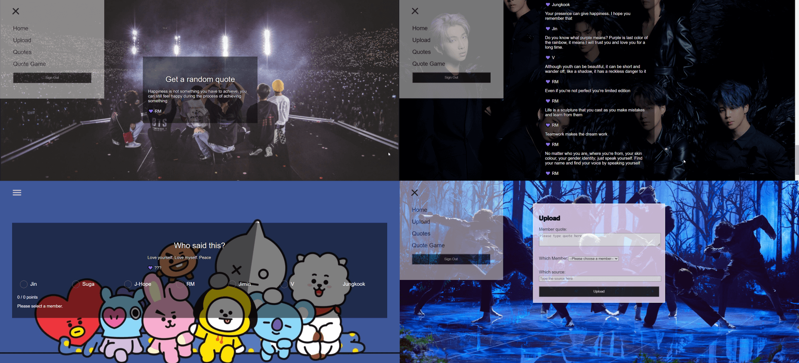

# "Borahae" project

## Live versie: https://borahae-quote.netlify.app/
Met behulp van React heb ik webapplicatie genaamd “Borahae" gemaakt voor Zuid Koreaanse K-Pop Band “BTS”. Waarin fans alle quotes van alle 7 members kunnen terugvinden op 1 plek, spelletjes kunnen spelen en quotes kunnen plaatsen van de members. Om te kunnen uploaden dient de fan ingelogd te zijn. Om de data van mijn gebruikers op te slaan zoals gebruikersnaam, email en wachtwoord, maak ik gebruik van Novi Backend API.

Mijn webapplicatie “Borahae” bevat de volgende functionaliteit:

- Fan kan een account aanmaken
- Fan kan inloggen
- Een ingelogde fan kan een quote uploaden
- Alle quotes zien van alle members
- Gebruiker kan raden van wie de quote is (game)

## Screenshots

## Benodigdheden

- Github repo van mij project vind je hier [Borahae](https://github.com/tahminahesari/Eindopdracht-Frontend.git).

- Om data opslaan is gebruik gemaakt van de [Novi Backend API](https://github.com/hogeschoolnovi/novi-educational-backend-documentation).

- Om data op te halen is gebruik gemaakt van de [BTS Quotes API](https://github.com/oanhgle/bangtan-api).

- Node.js dient geinstalleerd te zijn om app te kunnen runnen. Ik heb versie v16.13.2 gebruikt tijdens het ontwikkelen.

## Installatie stappen

1. Download de repo: `git clone https://github.com/tahminahesari/Eindopdracht-Frontend.git ` of get from VCS in Webstorm
2. Installeer de dependencies: `npm install`
3. En start dan de app: `npm start`

## Inloggegevens

Er zijn geen standaard accounts beschikbaar, om in te logggen dient gebruiker te registeren via de browsers via [http://localhost:3000/signup](http://localhost:3000/signup).
Met de volgende gegevens:

- gebruikersnaam
- email
- wachtwoord

En het vervolgens inloggen via [http://localhost:3000/signIn](http://localhost:3000/signIn).
Met de volgende gegevens:

- gebruikersnaam
- wachtwoord

## NPM Commando's

- `npm start`
  om de applicatie te starten.

  Open [http://localhost:3000](http://localhost:3000) om het in de browser te bekijken.

- `npm test`
  om te je code te testen voor het deployen.

- `npm run build`
  voor optimaliseren en voor het betere gebruikerservaring.

- `npm run eject`
  Maakt de instellingen van Create React App zichtbaar, en aanpasbaar, dit proces is niet terug te draaien.
